# Boulder - High-Performance Open Source S3-Compatible Storage Service

  <a href="./README.md">中文</a> | <a href="./README_EN.md">English</a>

Boulder is an open-source S3-compatible storage service focused on **efficient storage utilization** and **high performance**, designed for large-scale object storage scenarios. It not only provides a fully compatible interface with Amazon S3 API but also significantly reduces storage costs through innovative data deduplication, compression, and organization methods while maintaining excellent read and write performance.

## Table of Contents

- [Core Features](#core-features)
- [Online Demo](#online-demo)
- [Technical Architecture](#technical-architecture)
- [Supported S3 APIs](#supported-s3-apis)
- [Configuration Instructions](#configuration-instructions)
- [Quick Start](#quick-start)
- [Performance Optimization and Tuning](#performance-optimization-and-tuning)
- [License](#license)

## Online Demo

You can experience Boulder's functionality through the following address:

- **Demo Address**: [http://110.42.45.16:3002/](http://110.42.45.16:3002/)
- **Login Information**:
  - Username: `boulder`
  - Password: `Abcd@1234`

## Core Features

### Ultimate Storage Efficiency

Boulder's core competitive advantage lies in its advanced data deduplication technology, which maximizes storage utilization without compromising performance:

- **Global Content Deduplication**: By generating unique hash fingerprints for each data chunk, the system can identify and eliminate duplicate data globally
- **High Proportion of Space Savings**: For data sets containing a lot of duplicate content (such as backup data, log files, virtual machine images, etc.), storage savings of up to 90% or more can be achieved
- **Intelligent Chunking Strategy**: Uses fastcdc algorithm for content-defined chunking, which dynamically adjusts chunk size based on data content characteristics
  - Small files (<1MB): chunk size ranges from 8KB to 64KB
  - Medium files (1MB-16MB): chunk size ranges from 16KB to 512KB
  - Large files (>16MB): chunk size ranges from 1MB to 4MB
- **Efficient Hash Calculation**: Uses high-performance hash algorithms (such as Blake3) to generate chunk fingerprints, balancing security and performance

### S3 Full Compatibility

Provides a 100% compatible interface with Amazon S3 API, which can seamlessly integrate with existing S3 clients and applications, supporting the following main operations:

- Bucket operations: create, delete, list buckets, etc.
- Object operations: upload, download, copy, delete objects, etc.
- Multipart upload: large file multipart upload, resumable upload, concurrent upload, etc.

### High-Performance Compression

Integrates advanced compression technology to maximize storage space savings while maintaining high performance:

- **zstd Compression Algorithm**: Integrates Facebook-developed zstd compression algorithm, providing excellent performance while maintaining high compression ratio
- **Adaptive Compression Level**: Automatically selects the optimal compression level based on data type and size, balancing compression ratio and CPU overhead
- **Batch Compression Optimization**: Performs batch compression on aggregated block data, improving compression efficiency and ratio
- **Compression-then-Encryption**: Ensures data is encrypted after compression for complete data protection

### Multiple Storage Backends and Types Support

Supports multiple storage backends and storage types to meet the needs of different scenarios:

- **Multiple Storage Backends**: Supports local disk, standard S3, and other storage backends
- **Multiple Storage Types**: Provides standard storage, infrequent access storage, and archive storage
- **Intelligent Tiering**: Supports automatic migration of data between different storage types based on access patterns

### Flexible Deployment Mode

Supports flexible deployment from single-node development testing to large-scale production clusters:

- **Plugin-based Design**: Adopts a modular plugin architecture with loosely coupled functional components for easy extension and customization
- **Single-node Deployment**: Runs in single-node mode by default, with simple configuration and excellent performance
  - Configuration data, event logs, and audit logs are stored in the local SQLite database by default
  - Suitable for development testing and small application scenarios
- **Cluster Deployment**: Supports clustered, distributed deployment through HTTP service interfaces
  - Can be configured to remotely store and query data through interfaces
  - Provides high availability, horizontal scaling capabilities, and load balancing
  - Suitable for large-scale production environments and high-concurrency scenarios

## Technical Architecture

Boulder adopts an advanced layered architecture design, achieving efficient storage utilization and excellent performance through innovative data processing and organization methods.

### System Architecture Diagram

### 1. Data Organization Architecture

Boulder adopts an innovative three-level data organization structure to achieve efficient storage utilization and data deduplication:

- **Object**: The storage unit directly operated by users, containing metadata and data references
- **Chunk**: Uses fastcdc algorithm to split object data into variable-length chunks (configurable size range), each chunk has a unique hash fingerprint
- **Block**: Aggregates multiple chunks into fixed-size blocks (approximately 64MB), which are then compressed with zstd and encrypted for storage

This design enables the system to efficiently handle duplicate data, and chunks with the same content only need to be stored once globally, significantly improving storage space utilization.

### 2. System Architecture Layers

- **Interface Layer (Handler)**: Processes HTTP requests, parses S3 API calls, and returns responses that comply with S3 specifications
- **Business Layer (Service)**: Implements core business logic, including object management, bucket management, multipart upload, etc.
- **Data Processing Layer**: Responsible for core functions such as data chunking, deduplication, compression, and encryption
- **Metadata Layer (Meta)**: Manages metadata information of objects, chunks, and blocks
- **Storage Layer (Storage)**: Provides underlying storage interfaces, supports multiple storage backends, and supports data compression and encryption

### 3. Storage Backends

Boulder supports the following storage backends:

- **Disk Storage (DiskStore)**: Stores data in the local file system
- **S3 Storage (S3Store)**: Stores data in S3 API-compatible storage services

### 4. Metadata Storage

- **Single-node Mode**: Uses BadgerDB (based on RocksDB) to store metadata
- **Cluster Mode**: Uses TiKV (based on RocksDB + Raft) to store metadata

## Supported S3 APIs

Boulder supports the following S3 API operations:

### Bucket Operations
- `CreateBucket`: Create a new bucket
- `HeadBucket`: Check if a bucket exists
- `ListBuckets`: List all buckets of a user
- `DeleteBucket`: Delete a bucket

### Object Operations
- `HeadObject`: Get object metadata
- `PutObject`: Upload an object
- `CopyObject`: Copy an object
- `GetObject`: Download an object
- `ListObjects`: List objects in a bucket (V1)
- `ListObjectsV2`: List objects in a bucket (V2)
- `DeleteObject`: Delete a single object
- `DeleteObjects`: Delete multiple objects in bulk

### Multipart Upload Operations
- `CreateMultipartUpload`: Initialize a multipart upload
- `AbortMultipartUpload`: Abort a multipart upload
- `UploadPart`: Upload a part of data
- `UploadPartCopy`: Copy a part of data
- `CompleteMultipartUpload`: Complete a multipart upload
- `ListParts`: List uploaded parts
- `ListMultipartUploads`: List in-progress multipart uploads

## Performance Optimization and Tuning

### Data Deduplication and Compression Optimization

1. **Adjusting Chunking Parameters**: Adjust the chunking parameters of fastcdc based on data characteristics to achieve optimal deduplication effects
   - For a large number of small files: consider reducing the minimum chunk size
   - For large files or single-type data: increase the standard chunk size

2. **Optimizing Compression Strategy**: Adjust compression parameters based on data type and performance requirements
   - High compression ratio mode: suitable for scenarios sensitive to storage space, such as backup data and archive data
   - High-performance mode: suitable for hot data with high access performance requirements
   - Auto mode: the system automatically selects the optimal compression level based on data type

3. **Deduplication Cache Optimization**: Properly adjust the deduplication cache size to balance memory usage and deduplication efficiency
   - Increasing cache size can improve the deduplication recognition speed of hot data

### Storage and I/O Optimization

1. **Storage Backend Selection**: Select an appropriate storage backend based on data access patterns and cost requirements
   - Hot data: choose high-performance local disks or SSD storage
   - Cold data: choose cost-optimized S3 or archive storage
   - Hybrid deployment: configure multiple storage backends based on data lifecycle

2. **Concurrency Parameter Adjustment**: Adjust concurrency parameters based on hardware resources and load conditions
   - Increasing concurrency can improve throughput but will increase CPU and memory usage

3. **Metadata Storage Optimization**: Select an appropriate metadata storage solution based on deployment scale
   - Single-node deployment: BadgerDB is used by default, with excellent performance and simple configuration
   - Cluster deployment: TiKV is recommended, providing distributed, highly available metadata storage

## License

The Boulder project is open-sourced under the **GNU General Public License v3.0**, allowing free use, modification, and distribution, but must maintain open-source status and the same license terms.

### Main License Terms

- **Free Use**: Anyone can use the Boulder service for free
- **Free Modification**: Source code can be modified as needed to adapt to specific requirements
- **Free Distribution**: Original or modified versions of the software can be copied and distributed
- **Open Source Requirements**: Any distributed modified version must be open-sourced under the same license
- **Copyright Notice Retention**: Original copyright and license notices must be retained

## Acknowledgments

The development of the Boulder project has benefited from the following open-source projects:

- [BadgerDB](https://github.com/dgraph-io/badger) - Efficient key-value storage
- [TiKV](https://github.com/tikv/tikv) - Distributed transactional key-value storage
- [fastcdc](https://github.com/PlakarKorp/go-cdc-chunkers) - Content-defined chunking algorithm
- [AWS SDK for Go](https://github.com/aws/aws-sdk-go-v2) - AWS service SDK

---