# Boulder - 高性能开源S3兼容存储服务

<p align="left">
  <a href="./README_ZH.md">中文</a> | <a href="./README.md">English</a>
</p>

Boulder 是一个专注于**高效存储利用率**和**高性能**的开源 S3 兼容存储服务，专为大规模对象存储场景设计。它不仅提供与 Amazon S3 API 完全兼容的接口，还通过创新的数据去重、压缩和组织方式，显著降低存储成本，同时保持出色的读写性能。

## 目录

- [核心特点](#核心特点)
- [在线演示](#在线演示)
- [技术架构](#技术架构)
- [支持的 S3 API](#支持的-s3-api)
- [配置说明](#配置说明)
- [安装部署](#安装部署)
- [快速开始](#快速开始)
- [性能优化与调优](#性能优化与调优)
- [许可证](#许可证)

## 在线演示

您可以通过以下地址体验 Boulder 的功能：

- **演示地址**: [http://110.42.45.16:3002/](http://110.42.45.16:3002/)
- **登录信息**:
  - 账户: `boulder`
  - 密码: `Abcd@1234`

## 核心特点

### 极致存储效率

Boulder 的核心竞争力在于其先进的数据去重技术，能够在不影响性能的前提下最大化存储利用率：

- **全局内容去重**: 通过为每个数据切片生成唯一哈希指纹，系统能够识别并消除全局范围内的重复数据
- **高比例空间节省**: 对于包含大量重复内容的数据集合（如备份数据、日志文件、虚拟机镜像等），可实现高达90%以上的存储节省
- **智能分块策略**: 采用 fastcdc 算法进行内容定义分块，能够基于数据内容特征动态调整切片大小
  - 小文件（<1MB）: 切片大小范围为 8KB-64KB
  - 中等文件（1MB-16MB）: 切片大小范围为 16KB-512KB
  - 大文件（>16MB）: 切片大小范围为 1MB-4MB
- **高效哈希计算**: 使用高性能哈希算法（如 Blake3）生成切片指纹，兼顾安全性和性能

### S3 完全兼容

提供与 Amazon S3 API 100%兼容的接口，可无缝对接现有 S3 客户端和应用，支持以下主要操作：

- 存储桶操作：创建、删除、列出存储桶等
- 对象操作：上传、下载、复制、删除对象等
- 分段上传：大文件分段上传、断点续传、并发上传等

### 高性能压缩

集成先进的压缩技术，在保持高性能的同时最大化存储空间节省：

- **zstd 压缩算法**: 集成 Facebook 开发的 zstd 压缩算法，在保持高压缩率的同时提供卓越的性能
- **自适应压缩级别**: 根据数据类型和大小自动选择最优压缩级别，平衡压缩率和CPU开销
- **批量压缩优化**: 对聚合后的块数据进行批量压缩，提高压缩效率和压缩率
- **压缩后加密**: 确保数据在压缩后进行加密存储，提供完整的数据保护

### 多存储后端与类型支持

支持多种存储后端和存储类型，满足不同场景的需求：

- **多存储后端**: 支持本地磁盘、标准 S3 等多种存储后端
- **多存储类型**: 提供标准存储、低频存储和归档存储等多种存储类型
- **智能分层**: 支持基于访问模式自动在不同存储类型间迁移数据

### 灵活插件式设计

本系统采用插件式设计，灵活支持从单机部署到大规模生产集群的部署：

- **插件模块列表**: 
  - **配置中心模块**: 存放系统全局配置、IAM配置数据。单机版使用内置的sqlite数据库插件版。 集群版使用用户自己实现的云配置插件服务。只要实现了插件接口（几个简单的restful读写接口），就可以替换为自己的配置中心。
  - **事件日志模块**: 把S3的事件模块独立一个外部插件，用户可以自己灵活处理这些事件数据。单机版默认使用内置的sqlite数据库插件版。 集群版使用用户自己实现的云服务。只要实现了插件接口（2个restful接口，一个用于写入事件日志，一个用于查询事件日志），就可以替换为自己的事件日志插件。
  - **审计日志模块**: 和事件日志模块类似，把审计日志也独立一个外部插件。用户可以自己灵活处理这些审计日志数据。单机版默认使用内置的sqlite数据库插件版。 集群版使用用户自己实现的云服务。只要实现了插件接口（2个restful接口，一个用于写入审计日志，一个用于查询审计日志），就可以替换为自己的审计日志插件。
  - **元数据存储模块**: 负责存储系统的元数据，包括对象、切片、块的元数据信息。单机版默认使用badgerDB数据库存储元数据，集群版只要支持用户自己定制的kv存储系统，只要支持系统定义的kv接口即可，系统已经 实现了基于tikv数据库的元数据存储插件。
  - **块存储模块**: 负责实际数据的存储。单机版默认使用本地磁盘存储 ，集群版可以根据需求配置自定义的块存储服务。系统已经实现了基于S3的块存储插件。


## 技术架构

Boulder 采用先进的分层架构设计，通过创新的数据处理和组织方式，实现了高效的存储利用和出色的性能表现。

### 系统架构图



### 1. 数据组织架构

Boulder 采用创新的三级数据组织结构，实现高效的存储利用和数据去重：

- **对象(Object)**: 用户直接操作的存储单元，包含元数据和数据引用
- **切片(Chunk)**: 使用 fastcdc 算法将对象数据切分为变长切片（可配置大小范围），每个切片都有唯一的哈希指纹
- **块(Block)**: 将多个切片聚合为固定大小的块（约 64MB），进行 zstd 压缩和加密后存储

这种设计使得系统能够高效处理重复数据，相同内容的切片在全局范围内只需存储一次，显著提高存储空间利用率。

### 2. 系统架构分层

- **接口层(Handler)**: 处理 HTTP 请求，解析 S3 API 调用，返回符合 S3 规范的响应
- **业务层(Service)**: 实现核心业务逻辑，包括对象管理、存储桶管理、分段上传等
- **数据处理层**: 负责数据切片、去重、压缩和加密等核心功能
- **元数据层(Meta)**: 管理对象、切片、块的元数据信息
- **存储层(Storage)**: 提供底层存储接口，支持多种存储后端, 支持数据压缩和加密

### 3. 存储后端

Boulder 支持以下存储后端：

- **磁盘存储(DiskStore)**: 将数据存储在本地文件系统
- **S3 存储(S3Store)**: 将数据存储在兼容 S3 API 的存储服务中

### 4. 元数据存储

- **单机模式**: 使用 BadgerDB（基于 RocksDB）存储元数据
- **集群模式**: 使用 TiKV（基于 RocksDB + Raft）存储元数据

## 支持的 S3 API

Boulder 支持以下 S3 API 操作：

### 存储桶操作
- `CreateBucket`: 创建新的存储桶
- `HeadBucket`: 检查存储桶是否存在
- `ListBuckets`: 列出用户所有存储桶
- `DeleteBucket`: 删除存储桶

### 对象操作
- `HeadObject`: 获取对象元数据
- `PutObject`: 上传对象
- `CopyObject`: 复制对象
- `GetObject`: 下载对象
- `ListObjects`: 列出存储桶中的对象 (V1)
- `ListObjectsV2`: 列出存储桶中的对象 (V2)
- `DeleteObject`: 删除单个对象
- `DeleteObjects`: 批量删除对象

### 分段上传操作
- `CreateMultipartUpload`: 初始化分段上传
- `AbortMultipartUpload`: 中止分段上传
- `UploadPart`: 上传分段数据
- `UploadPartCopy`: 复制分段数据
- `CompleteMultipartUpload`: 完成分段上传
- `ListParts`: 列出已上传的分段
- `ListMultipartUploads`: 列出正在进行的分段上传

## 配置说明

Boulder 通过配置文件 `config.yaml` 进行系统参数配置。以下是主要配置项的说明：

### 基本配置

```yaml
server:
  address: ":3000"
  console_address: "3002"
config:
  driver: "sqlite"
  dsn: "./data/sqlite/dedups3.db"
audit:
  driver: "sqlite"
  dsn: "./data/sqlite/dedups3.db"
event:
  driver: "sqlite"
  dsn: "./data/sqlite/dedups3.db"
admin:
  username: "boulder"
  password: "Abcd@1234"
  access_key: "GGP5NTUY9WRH5NS78UVU"
  secret_key: "5oj6y3Jy7MO4Y2FTI5dOUvCbnOZf8mQGvbCqGN4I"
```

详细配置说明请参考项目中的示例配置文件。

## 性能优化与调优

### 数据去重与压缩优化

1. **调整分块参数**: 根据数据特点调整 fastcdc 的分块参数以获得最佳去重效果
   - 对于大量小文件: 可考虑减小最小分块大小
   - 对于大文件或单一类型数据: 可增大标准分块大小

2. **优化压缩策略**: 根据数据类型和性能需求调整压缩参数
   - 高压缩率模式: 适合备份数据、归档数据等对存储空间敏感的场景
   - 高性能模式: 适合对访问性能要求高的热数据
   - 自动模式: 系统根据数据类型自动选择最优压缩级别

3. **去重缓存优化**: 适当调整去重缓存大小，平衡内存占用和去重效率
   - 增加缓存大小可提高热点数据的去重识别速度

### 存储与I/O优化

1. **存储后端选择**: 根据数据访问模式和成本需求选择合适的存储后端
   - 热数据: 选择高性能的本地磁盘或SSD存储
   - 冷数据: 选择成本优化的S3或归档存储
   - 混合部署: 根据数据生命周期配置多种存储后端

2. **并发参数调整**: 根据硬件资源和负载情况调整并发参数
   - 增加并发可提高吞吐量，但会增加CPU和内存占用

3. **元数据存储优化**: 根据部署规模选择合适的元数据存储方案
   - 单机部署: 默认使用BadgerDB，性能优秀且配置简单
   - 集群部署: 推荐使用TiKV，提供分布式、高可用的元数据存储

## 安装部署

### 前置条件

在开始安装部署前，请确保您的环境满足以下要求：

- **前端编译环境**：Node.js 14+ 和 npm 6+
- **后端编译环境**：Go 1.16+ 开发环境
- **运行环境**： linux 系统

### 编译步骤

#### 1. 编译前端代码

```bash
# 进入控制台目录
cd console

# 安装依赖
npm install

# 构建前端代码
npm run build

# 构建完成后，会在 console/dist 目录生成静态资源文件
```

#### 2. 复制前端资源到后端目录

```bash
cp -r console/dist server/web/dist
```

#### 3. 编译后端代码

```bash
# 进入服务器目录
cd server

# 安装 Go 依赖
go mod download

# 编译后端代码
go build -o dedups3

# 编译完成后，会生成 dedups3 二进制可执行文件
```

### 部署方式

#### 单机部署（默认模式）

单机部署是最简单的部署方式，适合开发测试和小规模应用场景：

```bash
# 在 server 目录下直接运行编译好的二进制文件
./dedups3

```

启动后，服务将默认在 3000 端口启动S3 服务，可以用S3 客户端工具进行访问。在30002 端口启动控制台服务，您可以通过浏览器访问 `http://localhost:30002` 进入管理界面。

#### 集群部署

对于生产环境和大规模部署，建议使用集群模式。集群部署需要配置以下组件：

1. **元数据存储**：部署 TiKV 集群作为元数据存储
2. **配置中心**：实现自定义配置中心插件
3. **事件日志**：配置外部事件日志服务
4. **审计日志**：配置外部审计日志服务
5. **负载均衡**：使用 Nginx 或其他负载均衡器分发请求

详细的集群部署配置，请参考配置文件中的相关说明。

## 许可证

Boulder 项目基于 **GNU General Public License v3.0** 开源，允许自由使用、修改和分发，但必须保持开源和相同的许可条款。

### 主要许可条款

- **自由使用**: 任何人都可以免费使用 Boulder 服务
- **自由修改**: 可以根据需要修改源代码以适应特定需求
- **自由分发**: 可以复制和分发软件的原始或修改版本
- **开源要求**: 任何分发的修改版本必须以相同许可证开源
- **版权声明保留**: 必须保留原始版权和许可证声明

## 鸣谢

Boulder 项目的开发得益于以下开源项目：

- [BadgerDB](https://github.com/dgraph-io/badger) - 高效的键值存储
- [TiKV](https://github.com/tikv/tikv) - 分布式事务型键值存储
- [fastcdc](https://github.com/PlakarKorp/go-cdc-chunkers) - 内容定义分块算法
- [AWS SDK for Go](https://github.com/aws/aws-sdk-go-v2) - AWS 服务 SDK

---
